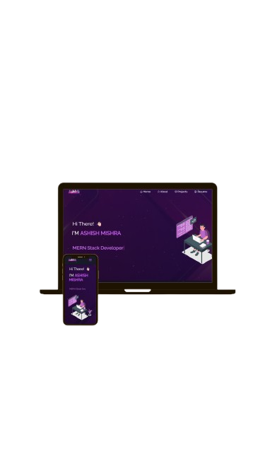

<h2 align="center">
  Portfolio Website - v2.0<br/>
  <a href="https://portfolio-ashish.vercel.app/" target="_blank">ashishportfolio.in</a>
</h2>

<div align="center">
  
</div>

<br/>

<center>

[](https://forthebadge.com) &nbsp;
[](https://forthebadge.com) &nbsp;
[](https://forthebadge.com) &nbsp;
 &nbsp;


</center>

<h3 align="center">
    🔹
    <a href="https://github.com/Ashishkumar667/portfolio/issues">Report Bug</a> &nbsp; &nbsp;
    🔹
    <a href="https://github.com/Ashishkumar667/portfolio/issues">Request Feature</a>
</h3>

---

## TL;DR

You can fork this repo and modify it to make your own portfolio. A simple credit back to [Ashishkumar667](https://github.com/Ashishkumar667/portfolio) would be appreciated. Thanks!

## 🛠 Built With

My personal portfolio [ashishportfolio.in](https://portfolio-ashish.vercel.app/) that showcases some of my GitHub projects, skills, and resume.

This project was built using:

- ⚛️ React.js
- 🌐 Node.js
- 🚂 Express.js
- 🎨 CSS3
- 🧰 VS Code
- ☁️ Vercel (for deployment)

---

## 🚀 Features

- 📖 **Multi-Page Layout**
- 🎨 **Styled with React-Bootstrap and CSS**
- 📱 **Fully Responsive Design**

---

## 🧑‍💻 Getting Started

Clone this repository. You need to have `node.js` and `git` installed globally.

```bash
git clone https://github.com/Ashishkumar667/portfolio.git
cd Portfolio
npm install
npm start
